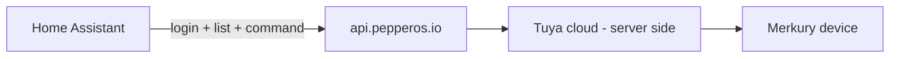

# Merkury Smart — Architecture

## Compatibility

This integration targets accounts and devices in the **Merkury Smart** app (`com.merkury.geeni`). The same Pepper OS backend is used by the **Geeni** app and other Pepper-powered brands — those accounts typically use brand slug `geeni` at login.

Hardware is still **Tuya-based** under the hood; Pepper OS is the account and control layer the mobile apps use today.

## What changed in Merkury Smart 3.x

Older Geeni/Merkury builds talked to Tuya's mobile API directly (embedded app keys). **Current Merkury Smart (v3.15+)** is a React Native app using **Pepper SDK**:

| Layer | Technology |
| ----- | ------------ |
| Mobile app | Merkury Smart / Geeni |
| Account API | `https://api.pepperos.io` |
| Auth | Basic `geeni:email:password` → session token + AWS creds |
| Device REST | AWS SigV4 signed `execute-api` requests |
| Realtime | `socket.pepperos.io` (Pepper Move — not used by this integration yet) |
| Device hardware | Tuya (managed server-side by Pepper) |

There are **no Tuya app keys** in the current APK to extract.

## Control path

## Integration components

| Module | Role |
| ------ | ---- |
| `pepper_cloud/client.py` | Login, signed REST, device list, commands |
| `pepper_cloud/signer.py` | AWS SigV4 for API Gateway |
| `pepper_cloud/devices.py` | Device typing and state normalization |
| `cloud.py` | Home Assistant wrapper |
| `coordinator.py` | Polls device list every 30s |
| `button.py` | Cloud restart command per device |

## Login flow

1. `POST /authentication/byEmail` with `Authorization: Basic base64(geeni:email:password)`
2. Response: `token` (peppertoken) + `pepperUser.awsUserCredentials`
3. `GET /account/devices` with `peppertoken` + SigV4
4. `PUT /account/devices/{id}/settings/powerStateOn/` with `{"valueJson":"1"|"0"}`
5. Optional: `PUT /account/devices/{id}/command/Restart/` with body `null` (Restart button in HA)

## Roadmap

1. **Done:** Pepper auth, discovery, switch/light on-off, restart button
2. **Next:** Brightness/color via `/account/devices/{id}/settings/{settingId}`
3. **Later:** WebSocket state updates (lower latency than polling)
